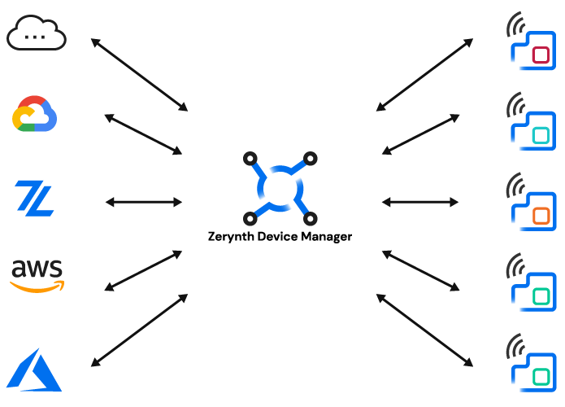

Zerynth is a platform that simplifies and accelerates the development of IoT applications.

Zerynth offers developers, system integrators, and businesses a way to enable IoT for their products, rapidly.

Zerynth includes various tools, software and hardware units. The entry point to the Zerynth journey is not fixed, it depends on the user's needs and goals.

  

The development of IOT projects is a very long journey. Typically an IOT project requires a hardware platform, used as reference for the development of the IOT device. Zerynth can help you in this phase, thanks to the <a href="https://www.zerynth.com/powered-by-zerynth/" target="_blank">**Zerynth Hardware**</a> and the <a href="https://www.zerynth.com/powered-by-zerynth/" target="_blank">**Zerynth Powered Devices**</a>. Zerynth hardware are Zerynth officially commercialized devices that are fully integrated with the Zerynth suite, providing users a seamless IOT development experience. Zerynth Powered Devices are third party hardware units that natively include the Zerynth OS, thus making it ready for being programmed and managed with the Zerynth suite. Zerynth also supports many other boards. A comprehensive list of all the supported boards, sensors, peripherals and libraries can be found <a href="https://testzdoc.zerynth.com/reference/boards/adafruit_feather_huzzah/docs/" target="_blank">**here**</a>.

Once you have identified your IOT hardware it is time to develop the firmware for your embedded devices. The <a href="https://www.zerynth.com/zos/" target="_blank">**Zerynth OS (ZOS)**</a> is a tiny real-time operating system that runs on a variety of 32bit microcontrollers allowing code portability within IOT platforms. It means that if you develop your firmware for Zerynth OS you can easily load it on all the Zerynth supported devices in a few clicks. The ZOS includes a Python Virtual Machine that allow developing IOT firmware in Python, or C and Python. For example, you can develop a motor control library in C in order to be very fast in the control cycle while developing the cloud connection code in Python in order to easily write and maintain the code.

  

To develop for ZOS and to be able to manage your board’s firmware upload you need to install the <a href="https://www.zerynth.com/zsdk/" target="_blank">**Zerynth SDK**</a>. Z-SDK is a cross platform (Windows, Linux and MAC) toolkit that includes <a href="/latest/develop/Develop/" target="_blank">**Zerynth Studio**</a>, <a href="/latest/reference/core/toolchain/docs/" target="_blank">**The Zerynth Tool Chain**</a> and various board programming tools, libraries and drivers.

  

Zerynth Studio is our IDE. It is a lightweight code editor fully integrated with the Zerynth suite that provides basic coding functionalities, board management tools and firmware loading routines. If you are an expert programmer you can easily develop your Zerynth Code using your preferred IDE and then use the Zerynth Tool Chain command line interface for the compilation, upload, and management of your developed firmware.

  

We also have released various third party IDE plugins that allow programming Zerynth firmwares from <a href="/latest/gettingstarted/Getting%20Started/#third-party-ide-plugins" target="_blank">**Visual Studio Code**</a>, Sublime Text and PyCharm.

  

The development of an IOT project is not finished with device firmware creation. An IOT device needs to be connected on a cloud service in order to be able to stream data, receive commands and be easily updated, disabled or killed if necessary.

  

IOT Device Management and Data collection is provided in Zerynth thanks to the <a href="https://www.zerynth.com/zdm/" target="_blank">**Zerynth Device Manager**</a>. ZDM is a data and device management system that allows to easily connect IOT devices to a cloud allowing an easy and intuitive management and aggregation of the data and a seamless management of IOT devices updates and security. ZDM is one of the few device managers available on the market that can be installed on premises on request. ZDM collects and stores your IOT data while also allowing a seamless forward to any other cloud (Azure, AWS, IBM, Google IOT) or backend service via Webhook or REST API.

You are at the end of the IOT development journey, if you need more help on finalizing your project or in converting your IOT prototype in an industrial project just check our <a href="https://www.zerynth.com/services/" target="_blank">**R&D**</a> services.

  

If you are interested in ready to use vertical IOT solutions, you can check the **Zerynth 4ZeroBox**. The <a href="/latest/4zp/4ZeroBox/" target="_blank">**Zerynth 4ZeroBox**</a> is a ready to use industrial unit that allows to easily interface modern and legacy industrial machines to the cloud, thus building the “digital twin” of the Industry 4.0 paradigms. The 4ZeroBox can be connected to the Zerynth Device Manager and collected data visualized thanks to our <a href="https://www.zerynth.com/blog/connect-zerynth-device-manager-with-grafana-iot-data-visualization/" target="_blank">**Grafana**</a> and <a href="https://www.zerynth.com/blog/iot-tutorial-learn-how-to-connect-power-bi-to-the-zerynth-device-manager/" target="_blank">**Microsoft PowerBi**</a> integrations. The 4ZeroBox has been already used in various industrial use-cases you can find documented <a href="https://www.zerynth.com/use-cases/" target="_blank">**here**</a>. 
