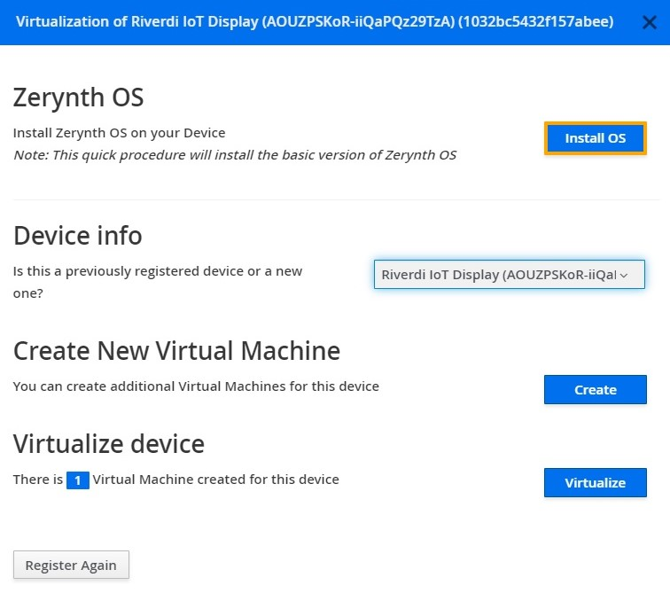
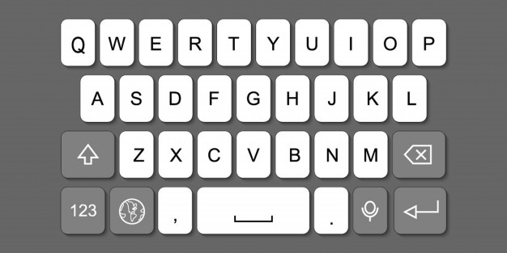
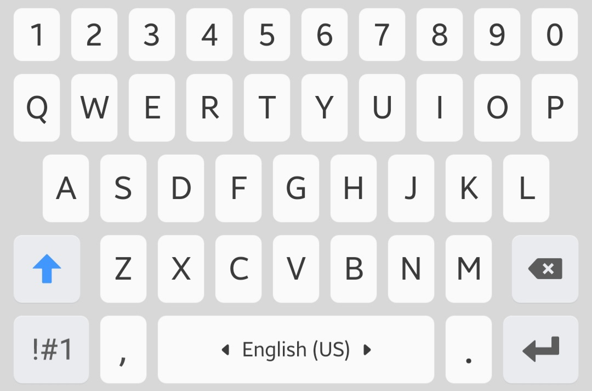

# Easy Keyboard Module with Zerynth and Riverdi IoT Display

This demo teaches how easy it is to develop the keyboard module with Zerynth tools, and the Riverdi IoT display. This keyboard module can be reused in many various projects in the future. It is an easy and efficient way to input parameters for an embedded application, like a ticket machine that prints subway tickets that need name and e-mail input, or Access Control System with two-factor authentication that needs a pin code input, or a wifi scan that needs a password input.

After this demo, the user will be able to reuse his keyboard module with just a few parameters changed during the initialization on any further project compatible with the latest version of [Zerynth ZDM](https://www.zerynth.com/zsdk/).

So, let’s start!

## REQUIREMENTS:

- [Riverdi IoT Display - RiTFT-50-IOT-CAP x 1](https://riverdi.com/product/ritft50iotcap/)
- [Zerynth SDK](https://www.zerynth.com/zsdk/) 

## STEP BY STEP:

1. Hardware Setup
2. Software Setup
3. The idea
4. Implementation
5. Summary


#### 1. Hardware Setup

[Riverdi IOT Display](https://riverdi.com/product/ritft50iotcap/) will be the heart of our project. Thanks to the 5-inch capacitive display with a resolution of 800×480 and the graphics controller [BT81X](https://brtchip.com/bt81x/) will allow precise positioning of the keyboard buttons.
 
Just connect the display and PC with a USB cable, as shown below:


#### 2. Software Setup


1. Download and Install [Zerynth Studio r.2.6.1]()https://www.zerynth.com/zsdk.
2. Once Zerynth is installed, the user can Connect, Register, and Virtualize the device.
   


3. Then it’s just a matter of selecting the [Riverdi IoT Display](https://docs.zerynth.com/latest/reference/boards/riverdi_tft50_iotxxx/docs/) from the Device dropdown.


#### 3. The idea

As we stated at the beginning, the main goal is to develop a keyboard layout that can be used on the other displays too. Therefore, our keyboard layout should be able to adjust and scale easily according to the display size.

From the development point of view, that means that all positions should be calculated from the initial values provided during the initialization. 

Let’s start with the design!

A regular keyboard, which can be found on smartphones, for example, has 4 rows and 10 columns.  



But compared to that, we will add a 5th row at the top, similar to the picture below, which will carry numbers, just to simplify some development challenges. 



This means we should divide the overall width of the keyboard by 10 and the overall height of the keyboard to 5. Also, we should not forget spacing between the buttons in both directions, vertical and horizontal.

Finally, our keyboard should also have both capital and lowercase letters, and all common symbols as any other keyboard have.

#### 4. Implementation


As we mentioned earlier, the initialization interface for our keyboard should be as simple as possible. So, let's consider that the user should only provide the height and width of the keyboard. If we know the number of the lines and the columns, that means that we must calculate the spacing between them.

```py
vSpac = 6               #   Vertical spacing between buttons
hSpac = 7               #   Vertical spacing between buttons
btnH = 50               #   Button Height
btnW = 70               #   Button Width
```

As you can see in the picture, the 3rd and 4th row are offset by half of the button width compared to other rows. 

```py
vOff = 204              #   Keyboard vertical offset
hOff_1 = 18             #   Keyboard horizontal offset (1)
hOff_2 = 53             #   Keyboard horizontal offset (2)
```

Now, we have all the necessary variables to calculate the position of each button. So let’s start adding buttons for the default screen one by one. 

```py
btn_q = bt81x.Button(keyb_h_1_offset + 0 * (keyb_btn_width + keyb_h_spacing), keyb_v_offset + ( keyb_v_spacing + keyb_btn_height), keyb_btn_width, keyb_btn_height, 31, 0, "q", palette=palette_B)
btn_w = bt81x.Button(keyb_h_1_offset + 1 * (keyb_btn_width + keyb_h_spacing), keyb_v_offset + ( keyb_v_spacing + keyb_btn_height), keyb_btn_width, keyb_btn_height, 31, 0, "w", palette=palette_B)
btn_e = bt81x.Button(keyb_h_1_offset + 2 * (keyb_btn_width + keyb_h_spacing), keyb_v_offset + ( keyb_v_spacing + keyb_btn_height), keyb_btn_width, keyb_btn_height, 31, 0, "e", palette=palette_B)
btn_r = bt81x.Button(keyb_h_1_offset + 3 * (keyb_btn_width + keyb_h_spacing), keyb_v_offset + ( keyb_v_spacing + keyb_btn_height), keyb_btn_width, keyb_btn_height, 31, 0, "r", palette=palette_B)
btn_t = bt81x.Button(keyb_h_1_offset + 4 * (keyb_btn_width + keyb_h_spacing), keyb_v_offset + ( keyb_v_spacing + keyb_btn_height), keyb_btn_width, keyb_btn_height, 31, 0, "t", palette=palette_B)
btn_z = bt81x.Button(keyb_h_1_offset + 5 * (keyb_btn_width + keyb_h_spacing), keyb_v_offset + ( keyb_v_spacing + keyb_btn_height), keyb_btn_width, keyb_btn_height, 31, 0, "z", palette=palette_B)
btn_u = bt81x.Button(keyb_h_1_offset + 6 * (keyb_btn_width + keyb_h_spacing), keyb_v_offset + ( keyb_v_spacing + keyb_btn_height), keyb_btn_width, keyb_btn_height, 31, 0, "u", palette=palette_B)
btn_i = bt81x.Button(keyb_h_1_offset + 7 * (keyb_btn_width + keyb_h_spacing), keyb_v_offset + ( keyb_v_spacing + keyb_btn_height), keyb_btn_width, keyb_btn_height, 31, 0, "i", palette=palette_B)
btn_o = bt81x.Button(keyb_h_1_offset + 8 * (keyb_btn_width + keyb_h_spacing), keyb_v_offset + ( keyb_v_spacing + keyb_btn_height), keyb_btn_width, keyb_btn_height, 31, 0, "o", palette=palette_B)
btn_p = bt81x.Button(keyb_h_1_offset + 9 * (keyb_btn_width + keyb_h_spacing), keyb_v_offset + ( keyb_v_spacing + keyb_btn_height), keyb_btn_width, keyb_btn_height, 31, 0, "p", palette=palette_B)
```

After adding all the buttons we should be able to present the keyboard on the screen. So let’s compile the code and uplink the code to the device. 


Voila, we have the keyboard layout. Now, let’s add the other layouts. We will have all the visual stuff implemented and ready for the logical part. 

Regarding the logic, we should add an event for each button press. Thanks to the [bt81x library](https://docs.zerynth.com/latest/reference/libs/bridgetek/bt81x/docs/bt81x/) that should be no big deal. As a step of the preparation for touch detection implementation we will add an array of the button object for each row separately. 

```py
btnNumList = [btn_1, btn_2, btn_3, btn_4, btn_5, btn_6, btn_7, btn_8, btn_9, btn_0]
btnSpecList = [btn_shift, btn_bksp, btn_space, btn_enter, btn_dot]
btnLower1List = [btn_q, btn_w, btn_e, btn_r, btn_t, btn_z, btn_u, btn_i, btn_o, btn_p] 
btnLower2List = [btn_a, btn_s, btn_d, btn_f, btn_g, btn_h, btn_j, btn_k, btn_l]
btnLower3List = [btn_y,btn_x,btn_c,btn_v,btn_b,btn_n,btn_m]
``` 

For the Capital letters we will have just 3 more arrays for 3 rows which displays the letters, while numbers and special characters are common for both screens. 

```py
btnCap1List = [btn_Q, btn_W, btn_E, btn_R, btn_T, btn_Z, btn_U, btn_I, btn_O, btn_P]
btnCap2List = [btn_A,btn_S,btn_D,btn_F,btn_G,btn_H,btn_J,btn_K,btn_L]
btnCap3List = [btn_Y, btn_X, btn_C, btn_V, btn_B, btn_N, btn_M]
```

Now while creating the screen for Capital or Lowecase letters we will loop through these arrays for the purpose of assigning tags for each button and displaying it. So the implementation for the function which should display the lowercases might look like this.

```py
def displayLowercase():
global btnNumList
global btnLower1List
global btnLower2List
global btnLower3List
global btnSpecList
tagValue = 1
offsetCounter = 0
for btn in btnNumList:
bt81x.track(hOff_1 + offsetCounter * (btnW + hSpac), vOff, btnW, btnH, tagValue)
bt81x.tag(tagValue)
bt81x.add_button(btn)
tagValue +=1
offsetCounter +=1

offsetCounter = 0
for btn in btnLower1List:
bt81x.track(hOff_1 + offsetCounter * (btnW + hSpac), vOff + (vSpac + btnH), btnW, btnH, tagValue)
bt81x.tag(tagValue)
bt81x.add_button(btn)
tagValue +=1
offsetCounter +=1

offsetCounter = 0
for btn in btnLower2List:
bt81x.track(hOff_2 + offsetCounter * (btnW + hSpac), vOff + 2 * (vSpac + btnH), btnW, btnH, tagValue)
bt81x.tag(tagValue)
bt81x.add_button(btn)
tagValue +=1
offsetCounter +=1

offsetCounter = 0
for btn in btnLower3List:
bt81x.track(hOff_2 + offsetCounter * (btnW + hSpac), vOff + 3 * (vSpac + btnH), btnW, btnH, tagValue)
bt81x.tag(tagValue)
bt81x.add_button(btn)
tagValue +=1
offsetCounter +=1

offsetCounter = 0
for btn in btnSpecList:
bt81x.track(hOff_2 + offsetCounter * (btnW + hSpac), vOff + 4 * (vSpac + btnH), btnW, btnH, tagValue)
bt81x.tag(tagValue)
bt81x.add_button(btn)
tagValue +=1
offsetCounter +=1
```

If we track what happens here we will realize that we have assigned tags for each button always in the same order which then gives us an opportunity to create an array of letters in the same order as tags are assigned and which later will be used to print pressed letter.

```py
#  Lowercase picker array
lowercaseArray = [ "",
                   "1", "2", "3", "4", "5", "6", "7", "8", "9", "0",
                   "q", "w", "e", "r", "t", "z", "u", "i", "o", "p",
                     "a", "s", "d", "f", "g", "h", "j"," k", "l",
                        "y", "x", "c", "v", "b", "n", "m",
                          "shift", "bksp", " ", "-", "."
                  ]
```


We also need the text box where typed letters will appear, for that purpose the text object is good enough. 

```py
textLabel = bt81x.Text(10,vOff-100,31,0,"",palette=palette_B)
```

Now let’s create the functions which will detect the exact letter pressed from the array and add it to the text object. Also, important to say, we need a variable which will be used to know what is currently active screen (Capital or Lowercase) letters. 

```py
def tag2char(tag):
global activeScreen
if activeScreen == 0:
return lowercaseArray[tag]
elif activeScreen == 1:
return capitalArray[tag]

def pressed(tag, tracked, tp):
global activeScreen
letter = tag2char(tag)
if letter == "bksp":
# When Backspace is pressed delete the last char
textLabel.text = textLabel.text[:-1]
elif letter == "shift":
# When shift is pressed:
- Toggle screen global,
- Clear the screen and switch to another one.
activeScreen = not activeScreen
bt81x.swap_and_empty()
else:
textLabel.text = textLabel.text + letter
```

As we can see here, the shift button decides which screen will be displayed. Since there are two screens, we need to toggle the screen each time SHIFT is pressed.

```py
def updateScreen():
global activeScreen
bt81x.dl_start()
bt81x.clear(1, 1, 1)
if activeScreen == 0:
displayLowercase()
elif activeScreen == 1:
displayCapital()
bt81x.display()
bt81x.swap_and_empty()
```

Now let's just initialize the screen, also call the touch loop which will trigger the event handler and display the initial screen.

```py
bt81x.init(SPI0, D4, D33, D34)
bt81x.touch_loop(((-1, pressed), ))
bt81x.dl_start()
bt81x.calibrate()
bt81x.swap_and_empty()
updateScreen()
```

After compiling and uplinking the code, let’s imagine that we are typing the SMS or WiFi credentials. The result will probably be something like this: 


#### 5. Summary

As we have demonstrated in this demo, it's easy to program a whole keyboard module, with the Zerynth tools and the Python-programmable Riverdi IoT display. Furthermore, this is a great starting position for an Access Control System, with two-factor authentication, where one of the parameters is a pin code or a password. Since security is of such importance in today's digital world, this kind of demo is a good learning experience for any developer.
Of course, the user can further customize the application to their liking, by changing a few parameters during the initialization. 

It's important to note that the user needs to have the latest version of the [Zerynth Device Manager](https://www.zerynth.com/zsdk/) to develop this project.

The code is available in our [GitHub repository](https://github.com/zerynth/demo_keyboard).
