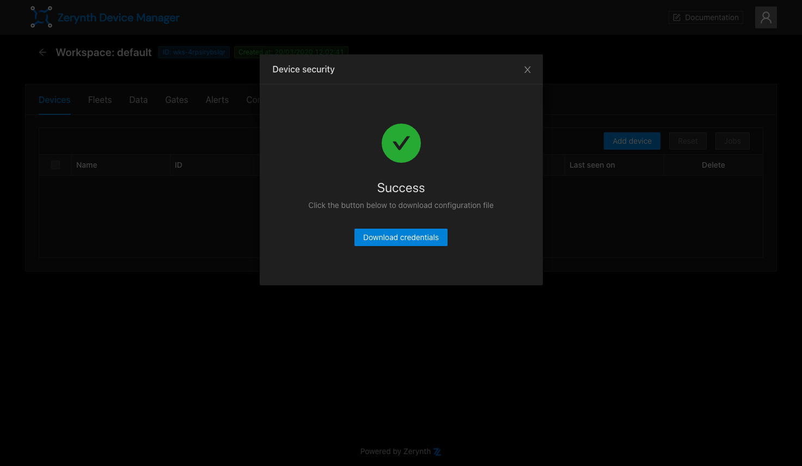

# Getting Started with a Raspberry PI

Zerynth Device Manager can be used for managing both microcontroller and microprocessor based devices. Let's see how to use
a microprocessor based device like the Raspberry PI with the ZDM.


## ZDM Client Python Library

If your device is powerful enough to run the standard Python distribution, the ZDM Client Python Library is what you need.

The latest stable version of the [ZDM-Client Python Library](https://pypi.org/project/zdm-client-py/){target=_blank} is available on PyPI.

This step requires that you have the latest Python version with pip.

In order to install the ZDM-Client Python Library, type the following command in a shell

````shell
pip install zdm-client-py
````

!!!Note
    If you have an old version of the ZDM-Client Python Library, type the command to update to the latest version


##Create an account
Register or login to the [ZDM](https://zdm.zerynth.com){target=_blank}. The first time you access the ZDM, 
a default workspace and a default fleet are created for you. Workspaces and fleets are ways of organizing your devices in the ZDM.
Open the workspace by clicking on it.

[  ](img/homepage.png)


##Create a device
Having accessed the workspace, it's time to create your first device!
Go to the **Devices** tab in the workspace page, then click on the **Add device** button.
In the popup you can provide a human readable name for the device and choose the fleet it will live in.
For now, just accept the default by clicking on the **Add** button.

[  ](img/newdevice.png)

Once the device is created, it needs a set of credentials to access the ZDM endpoints in a secure way.
Choosing credentials types and the security level can be a daunting task. Luckily the ZDM presents you a popup
with sensible defaults. Just press the **OK** button and you get a medium level of security just out of the box.

[  ](img/devicesecurity.png)

Once credentials are ready, you can download them into a **zdevice.json** file. Keep it around, you will need it shortly.

[  ](img/downloadcredentials.png)

##Publish data

You can now use the ZDM-Client Python libraty for connecting your CPU based device to the ZDM and stream your data.

Create a new Python project with your preferred editor and paste the **zdevice.json** file inside it.
Create a Python file **zdm_basic.py** and paste this
simple code into it:

````python
import zdm
import random
import time

def pub_temp_hum():
    # this function publish into the tag weather two random values: the temperature and the humidity
    tag = 'weather'
    temp = random.randint(19, 38)
    hum = random.randint(50, 70)
    payload = {'temp': temp, 'hum': hum}
    device.publish(payload, tag)
    print('Published: ', payload)


# connect to the ZDM using credentials in zdevice.json file
device = zdm.ZDMClient()
device.connect()

# infinite loop
while True:
    pub_temp_hum()
    time.sleep(5)
````

To run the above code, just type the command:

````shell
python zdm_basic.py
````

It will connect to the ZDM and start publishing data!

##Inspect the device
You can now go back to the ZDM and check the incoming data stream.
Open the device page by clicking on the *my_new_device*. There is a lot of information on this page but you can ignore most of it for now
and just check the incoming messages in the data widget.

[  ](img/dataconsole.png)

...and we are done!


