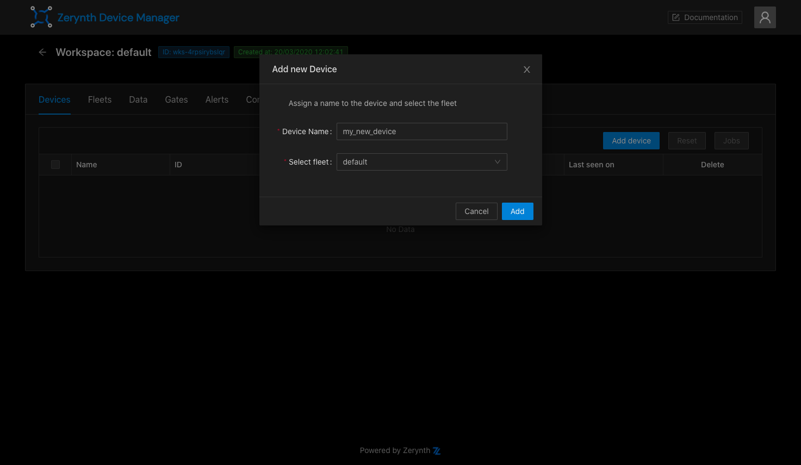

# Getting started with Zerynth SDK

This step by step tutorial explains how to program a device with the Zerynth SDK and connect it to the Zerynth Device Manager.

!!!Requirements
    1.  Zerynth Studio r2.6.0
    2.  ESP32-DevKitC (or another supported device)

##Create an account
Register or login to the [ZDM](https://zdm.zerynth.com){target=_blank}. The first time you access the ZDM, 
a default workspace and a default fleet are created for you. Workspaces and fleets are ways of organizing your devices in the ZDM.
Open the workspace by clicking on it.

##Create a device
Having accessed the workspace, it's time to create your first device!
Go to the **Devices** tab in the workspace page, then click on the **Add device** button.
In the popup you can provide a human readable name for the device and choose the fleet it will live in.
For now, just accept the default by clicking on the **Add** button.

Once the device is created, it needs a set of credentials to access the ZDM endpoints in a secure way.
Choosing credentials types and the security level can be a daunting task. Luckily the ZDM presents you a popup
with sensible defaults. Just press the **OK** button and you get a medium level of security just out of the box.

Once credentials are ready, you can download them into a **zdevice.json** file. Keep it around, you will need it shortly.

##Prepare the firmware
You now need to open up Zerynth Studio, our IDE, and program your device with one of the many examples it offers.
If you don't have Zerynth Studio installed, follow this [quick getting started](../gettingstarted/Getting Started.md) and come back here.

Done? You should now have a device with the Zerynth OS running on it, just waiting for some firmware to execute. Let's do it.

With Zerynth Studio opened, click on the lamp bulb to access the examples and type **ZDM** in the search bar.

Select and **Clone** the **ZDM Simple** example, then open the **main.py** file.

The example only needs your wifi credentials in order to work properly. Edit line *29* with your network name and password.
There are better way of providing wifi credentials to a device, but for the sake of this tutorial, let's just write them in the firmware.

We are almost done with the configuration: the only missing piece is the **zdevice.json** file we saved earlier. Let's copy it into the
Zerynth Studio project.

##Publish data

Once the device runs the Zerynth OS and the project is properly configured with credentials, you can now compile the firmware and 
transfer it on the device to be executed.

Just press the **Uplink** button (the *up-arrow* button at the top) and transfer the program on the device.

To check for output messages, press the **Console** button (the fourth one after the device bar) and verify that the device is connected to the wifi and started to publish random data to the ZDM!

##Inspect the device
You can now go back to the ZDM and check the incoming data stream.
Open the device page by clicking on the *my_new_device*. There is a lot of information on this page but you can ignore most of it for now
and just check the incoming messages in the data widget.

...and we are done! If you want to know more, we suggest to clone more advanced examples in Zerynth Studio and test them out.

