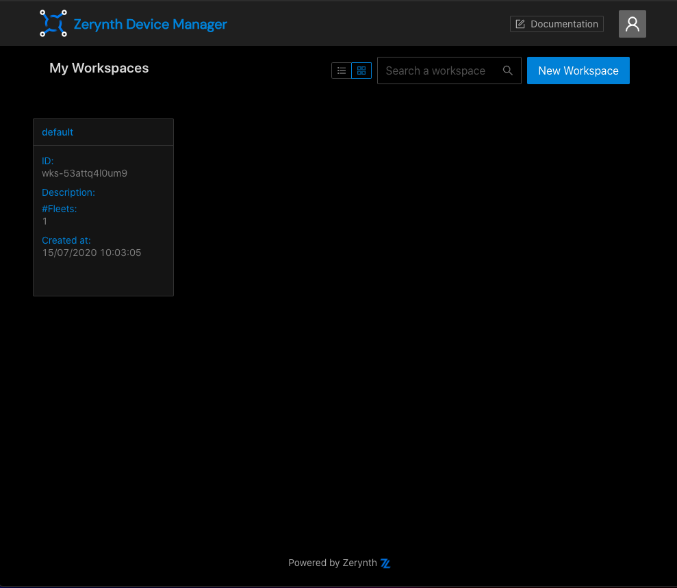
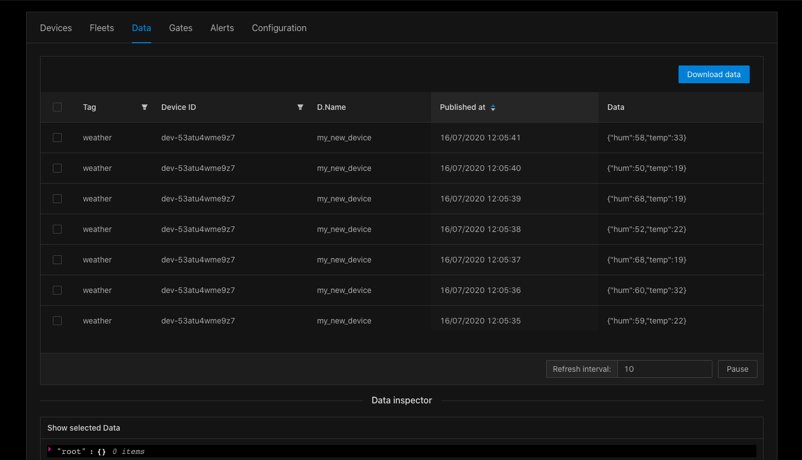
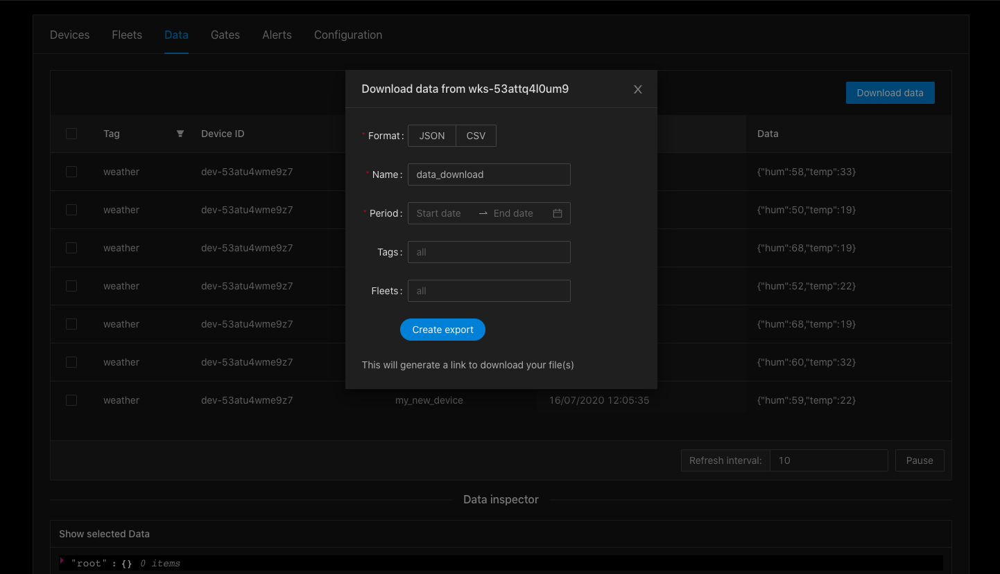
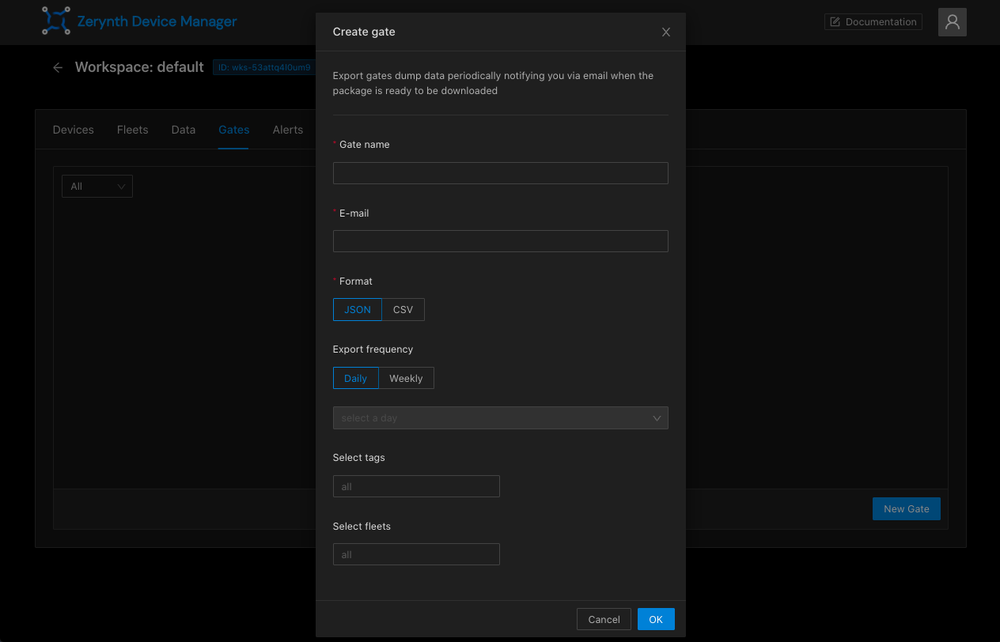
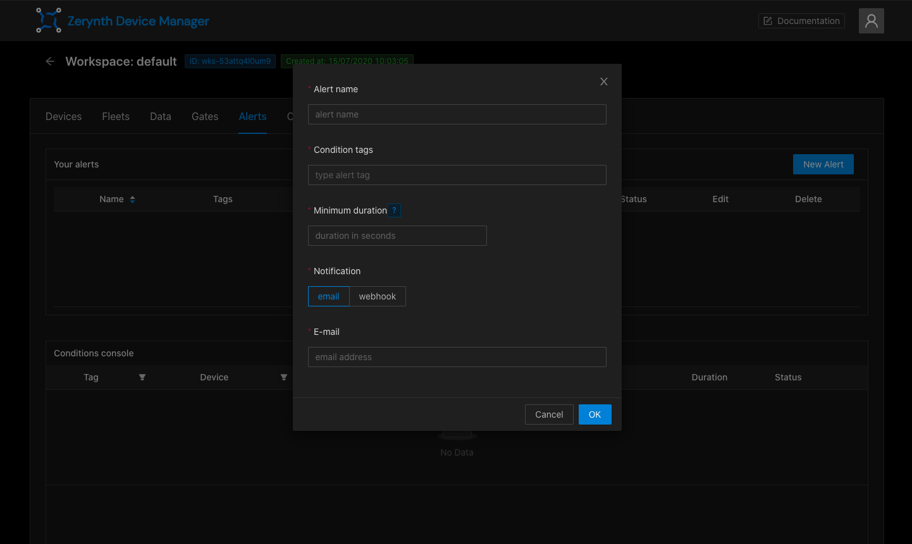

# Zerynth Device Manager Web App

Go to [https://zdm.zerynth.com](https://zdm.zerynth.com/){target=_blank} and login.

## Home Page

From here you can get an overview of your workspaces, search for them and add new ones.

Each user has the “Default Workspace” configured with the “Default Fleet” that can be used as default playground for starting with the ZDM. You can easily add more workspaces and fleets if needed.

Keep your projects well organized! We suggest using a new workspace for each new project.

## Add a new Workspace

If you want to create a new workspace, click on the “New Workspace” button, choose the name and optionally add a description and fleets.

If you don’t create any fleets, a "Default" one will be automatically added so that you will be ready to add new devices.

## Inspect a Workspace

To open a workspace just click on it from the Home Page.
The workspace page allows you to manage Devices, Fleets, Data, Gates, Conditions, Alerts and some other features.

###Workspace configuration

In the "Configuration" tab of a workspace it's possible to generate and manage API keys for the workspace.
You can use API keys to call the ZDM REST API. To create a new API key click on the "New API Key" button,
then copy and save the generated key. You can enable and disable your keys using the switch in the API key table.

## Devices

"Devices" tab allows you to create and manage your ZDM devices.

Devices can be filtered by fleets and ordered by creation date. 

The devices table gives you some information like name, id, fleet and device activity and state.
You can also use this table to delete your unused devices.

To add a new device you need to:

1.   **Create a device**

    Click on the button "Add Device" and choose a name and a fleet.
    

2.   **Generate credentials**
    
    To connect the device to the ZDM, configure the device's security (Credentials type and Endpoint type).
    

You can now connect your device to the ZDM using the zdevice.json file, download it and move it inside your project's directory, then uplink the firmware to your device.

###Device page

You can open the device page by clicking on a device name.
On the top of the page you will see device's information and its status and the tags it publishes data to.

Use this page to perform operations such as Fota update, rename the device, send jobs to the device,  generate new device credentials.

**Last hour activity and data console**

At the bottom of the device page the "Last hour activity" chart and the Data Console allow you to monitor the device activity.

By clicking in the left checkboxes you can navigate the published data, they will be presented on the bottom in the “Data inspector”.

###FOTA

The FOTA (Firmware Over The Air) update procedure can be used to update a device's firmware remotely.

!!! important
	 In order to perform the FOTA of a device you need to install a “Fota Enabled” Zerynth OS

The first step to start a FOTA update on your devices is to prepare and upload a firmware to the ZDM.

To upload your firmware, open Zerynth Studio (**Note:** Zerynth studio r2.6.0 or higher is required). Open the project you want to send to the device and click the Zerynth Device Manager Icon on the left bar.

Now click the ZDM FOTA Prepare button.

Select the ZDM device you want to update and choose a firmware version identifier (you can’t reuse a version identifier previously used), click prepare.

When the firmware preparation is completed, if you want to go ahead with the FOTA procedure, click Open ZDM GUI.

You will be redirected to the ZDM selected device page.

Just click FOTA, select the firmware you just uploaded and click Start.

The FOTA procedure will be scheduled on your device. Refresh the device Status form and you will see the status of the FOTA procedure.

###Jobs
To send jobs you can use the devices table or the single device page.
In the devices page, select a device and click the "Jobs" button. Wou will see the list of the jobs that the selected device supports.

Jobs can have arguments, specified as a json object.

## Fleets

On the fleets page you can view a list of your fleets with the ability to add new fleets.

## Data management

"Data" tab allows you to see real time data published by all the devices of the workspace, ordered by date.
The data page refreshes every 10 seconds, but you can also pause it or change the refresh interval using the input at the bottom.
As for the device page, the data inspector allows you to view data in a JSON-like format.

It is possible to download your devices data clicking on the "Download data" button, that allows you to configure your download preferences including format and time range.

## Gates

Gates are the interfaces the ZDM uses for forward your devices data to external services.
There are 3 different kinds of gates:

* Webhooks
* Export gates
* Ubidots gates

Clicking on the "Gate" tab, you will see a list of your gates with the possibility to filter them by type.

To create a new Gate, click on the "New Gate" button and choose the gate type.

###Webhooks

A Webhook Gate periodically forwards your devices via HTTP POST requests. It requires a name, the URL for the request
and the time interval (in seconds).
You can also add optional fields as "Fleets" and "Tags" to filter on data, or an authorization token if needed.

###Ubidots Gates

Ubidots Gates can be used to send your devices data to your Ubidots dashboard in real time.
To create a Ubidots Gate you need to specify a name, your ubidots account type, your ubidots device label,
the time interval (in seconds) between requests and your Ubidots API token.
You can also add optional tags and fleets to filter data.

###Export Gates

Export Gates can be used to periodically export retained data and receive via email a link for downloading.
To add a new Export Gate, you have to type a name, your e-mail address, the export format and frequency.
It's possible to add optional data filters for tags and fleets.

##Alerts

Clicking on the "Alerts" tab you will see a two-section page:

* A table containing all the alerts you have created
* The condition console

In this page you can see real time conditions sent by your devices and handle alerts.
If you create an alert, you will be notified when devices open and close conditions on specific tags declared at the moment of the alert creation.
To create a new alert, click on the "New Alert" button.

To create an alert, you have to specify a name, the conditions tags you want to be notified, the threshold a condition have to reach to be notified and the notifications configuration.

##Traffic monitoring

You can see details about ZDM usage and traffic consumption simply by clicking on the user avatar at the top right, then on "usage".

You will see the percentage of the traffic consumed and your data storage details (data retention, the oldest data date).

In the table below, there's a list of consumption details grouped by workspace.

