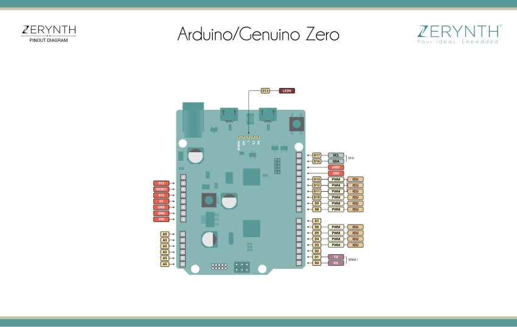

# Arduino/Genuino Zero

The Arduino/Genuino Zero is a microcontroller device based on the Atmel [SAMD21G18AU ARM Cortex-M0+ CPU](http://www.atmel.com/Images/Atmel-42181-SAM-D21_Datasheet.pdf). It is a simple and powerful 32-bit extension of the platform established by the UNO. It has 20 digital input/output pins (of which 10 can be used as PWM outputs), 6 analog inputs, 2 UARTs (hardware serial ports), a 48 MHz clock, 1 DAC (digital to analog), 1 TWI, an SPI header, a JTAG header, a reset button.

One of its most important features is the Atmel Embedded Debugger (EDBG), which provides a full debug interface without the need for additional hardware, significantly increasing the ease-of-use for software debugging. EDBG also supports a virtual COM port that can be used for device and bootloader programming.

<p style="text-align:center;"></p>

!!! warning
	Unlike most Arduino & Genuino devices, the Zero runs at 3.3V. The maximum voltage that the I/O pins can tolerate is 3.3V. Applying voltages higher than 3.3V to any I/O pin could damage the device.

!!! note
	All the reported information are extracted from the official [Arduino/Genuino Zero page](http://www.arduino.cc/en/Main/ArduinoBoardZero), visit this page for more details and updates.

## Pin Mapping



Arduino/Genuino Zero Official Schematic, Reference Design and Pin Mapping are available on the official [Arduino/Genuino Zero reference page](http://www.arduino.cc/en/Main/ArduinoBoardZero).

## Flash Layout

The internal flash of the Arduino/Genuino Zero is organized as a single bank of 256k. Zerynth VM overwrites SAM-BA Bootloader located at Flash start, SAM-BA bootloader can be restored using Arduino IDE.

## Device Summary


* Microcontroller: ATSAMD21G18
* Operating Voltage: 3.3V
* Digital I/O Pins (DIO): 20
* Analog Input Pins (ADC): 6
* Analog Outputs Pins (DAC): 1
* UARTs: 2
* SPIs: 1
* I2Cs: 1
* Flash Memory: 256 KB
* SRAM: 32 KB
* Clock Speed: 48 MHz
* Size (LxW mm): 68.0 x 30.0

## Power

The Arduino/Genuino Zero can be powered via the USB connector or with an external power supply. The power source is selected automatically.
External (non-USB) power can come either from an AC-to-DC adapter (such as a wall-wart) or battery, and can be connected using a 2.1mm center-positive plug connected to the device’s power jack, or directly to the GND and VIN pin headers of the POWER connector.

The device can operate on an external supply of 6 to 20 volts. If supplied with less than 7V, however, the 5V pin may supply less than five volts and the device may be unstable. If more than 12V are used, the voltage regulator may overheat and damage the device. The recommended range is 7 to 12 volts.

## Connect, Register, Virtualize and Program

The Arduino/Genuino Zero Programming port is connected to EDBG, which provides a virtual COM port to software on a connected computer. To recognize the device, **Windows** machines requires drivers that can be downloaded from [the Arduino/Genuino Zero guide](https://www.arduino.cc/en/Guide/ArduinoZero), while **OSX** and **Linux** machines will recognize the device as a COM port automatically.

!!! note
	**For Linux Platform**: to allow the access to serial ports the user needs read/write access to the serial device file. Adding the user to the group, that owns this file, gives the required read/write access: **Ubuntu** distribution –> dialout group; **Arch Linux** distribution –> uucp group.

    If the device is still not recognized or not working, the following udev rules may need to be added:

    ```py
    #Genuino Zero Device
    SUBSYSTEMS=="usb", ATTRS{idVendor}=="03eb", ATTRS{idProduct}=="2157", MODE="0666", GROUP="users", ENV{ID_MM_DEVICE_IGNORE}="1"
    SUBSYSTEMS=="tty", ATTRS{idVendor}=="03eb", ATTRS{idProduct}=="2157", MODE="0666", GROUP="users", ENV{ID_MM_DEVICE_IGNORE}="1"
    ```

EDBG is also connected to the SAMD21 hardware UART. Serial on pins RX0 and TX0 provides Serial-to-USB communication for programming the device through Atmel EDBG.

Once connected on a USB port, if drivers have been correctly installed, the Arduino/Genuino Zero device is recognized by Zerynth Studio. The next steps are:


* **Select** the Arduino/Genuino Zero on the **Device Management Toolbar**;
* **Register** the device by clicking the “Z” button from the Zerynth Studio;
* **Create** a Virtual Machine for the device by clicking the “Z” button for the second time;
* **Virtualize** the device by clicking the “Z” button for the third time.

!!! note
	No user intervention on the device is required for registration and virtualization process.

After virtualization, the Arduino/Genuino Zero is ready to be programmed and the  Zerynth scripts **uploaded**. Just **Select** the virtualized device from the “Device Management Toolbar” and **click** the dedicated “upload” button of Zerynth Studio and **reset** the device by pressing the Reset on-board button when asked.

## Firmware Over the Air update (FOTA)

The Firmware Over the Air feature allows to update the device firmware at runtime. Zerynth FOTA in the Arduino/Genuino Zero device is available for bytecode only.

Flash Layout is shown in table below:

| Start address | Size | Content         |
|---------------|------|-----------------|
| 0x00002000    | 88Kb | VM Slot         |
| 0x00018000    | 80Kb | Bytecode Slot 0 |
| 0x0002C000    | 80Kb | Bytecode Slot 1 |

## Power Management and Secure Firmware

Power Management feature allows to optimize power consumption by putting the device in low consumption state.

Secure Firmware feature allows to detect and recover from malfunctions and, when supported, to protect the running firmware (e.g. disabling the external access to flash or assigning protected RAM memory to critical parts of the system).

Both these features are strongly platform dependent; more information at [Power Management - Microchip SAMD21 section](https://docs.zerynth.com/latest/official/core.zerynth.stdlib/docs/official_core.zerynth.stdlib_pwr.html#pwr-samd21) and [Secure Firmware - Microchip SAMD21 section](https://docs.zerynth.com/latest/official/core.zerynth.stdlib/docs/official_core.zerynth.stdlib_sfw.html#sfw-samd21).
<!--stackedit_data:
eyJoaXN0b3J5IjpbLTEzNjQxOTQ3NzAsMjA3MzA1Ml19
-->
