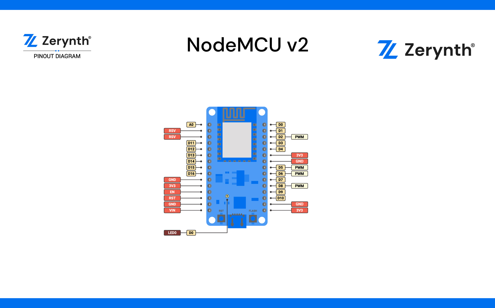

# NodeMCU v2

NodeMCU is an open source IoT platform including a firmware which runs on the ESP8266 with the Espressif Non-OS SDK, and hardware based on the ESP-12 module. The device features 4MB of flash memory, 80MHz of system clock, around 50k of usable RAM and an on chip Wifi Transceiver.

<p style="text-align:center;"></p>

## Pin Mapping



Official reference for NodeMCU can be found [here](http://nodemcu.com/index_en.html).

## Flash Layout

The NodeMCU v2 device features a 4 MB (32 Mb) flash memory organized in sectors of 4k each. The flash memory address starts at 0x40200000 and can be read and written from a Zerynth program using the internal flash module.

!!! warning
	If flash memory must be used in a Zerynth program, it is recommended to begin using it from secure addresses towards the end the bytecode (start address of the bytecode can be found in the log console of Zerynth Studio during the ```uplink``` operation), leaving a minimum safe place to minimize the chance of clashes.

!!! note
	The internal flash of NodeMCU can be organized in different ways. The standard VM is a non-FOTA VM with the VM code beginning at 0x0000, followed by the esp8266 ir0m image at 0x20000 and the esp_init_data at 0x3fc000. The VM is based on the Espressif RTOS SDK 1.4.1.

## Device Summary


* Microcontroller: Tensilica 32-bit RISC CPU Xtensa LX106
* Operating Voltage: 3.3V
* Input Voltage: 7-12V
* Digital I/O Pins (DIO): 16
* Analog Input Pins (ADC): 1
* UARTs: 1
* SPIs: 1
* I2Cs: 1
* Flash Memory: 4 MB
* SRAM: 64 KB
* Clock Speed: 80 Mhz
* Wi-Fi: IEEE 802.11 b/g/n:
    * Integrated TR switch, balun, LNA, power amplifier and matching network
    * WEP or WPA/WPA2 authentication, or open networks

## Power

Power to the NodeMCU v2 is supplied via the on-board USB Micro B connector or directly via the “VIN” pin. The power source is selected automatically.

The device can operate on an external supply of 6 to 20 volts. If using more than 12V, the voltage regulator may overheat and damage the device. The recommended range is 7 to 12 volts.

## Connect, Register, Virtualize and Program

The NodeMCU v2 exposes the serial port of the ESP8266 module via a CP2102 usb bridge which is also connected to the boot pins of the module, allowing for a seamless virtualization of the device.

!!! note
	Drivers for the bridge can be downloaded [here](https://www.silabs.com/products/mcu/Pages/USBtoUARTBridgeVCPDrivers.aspx) and are needed for **Windows and Mac platforms**.

!!! bote
	**For Linux Platform**: to allow the access to serial ports the user needs read/write access to the serial device file. Adding the user to the group, that owns this file, gives the required read/write access: **Ubuntu** distribution –> dialout group; **Arch Linux** distribution –> uucp group.

Once connected to a USB port the NodeMCU v2 device can be seen as a Virtual Serial port and it is automatically recognized by Zerynth Studio. The next steps are:

* **Select** the NodeMCU on the **Device Management Toolbar**;
* **Register** the device by clicking the “Z” button from the Zerynth Studio;
* **Create** a Virtual Machine for the device by clicking the “Z” button for the second time;
* **Virtualize** the device by clicking the “Z” button for the third time.

!!! note
	No user intervention on the device is required for registration and virtualization process

After virtualization, the NodeMCU v2 device is ready to be programmed and the  Zerynth scripts **uploaded**. Just **Select** the virtualized device from the “Device Management Toolbar” and **click** the dedicated “upload” button of Zerynth Studio.

!!! note
	No user intervention on the device is required for the upload process.

!!! important
	To exploit the Wi-Fi chip functionalities of the NodeMCU, the lib.espressif.esp8266wifi library must be installed (some example code is provided).

## Firmware Over the Air update (FOTA)

The Firmware Over the Air feature allows to update the device firmware at runtime. Zerynth FOTA in the NodeMCU v2 device is available for bytecode only.

Flash Layout is shown in table below:

| Start address | Size  | Content         |
|---------------|-------|-----------------|
| 0x40200000    | 448Kb | VM Slot         |
| 0x40270000    | 256Kb | Bytecode Slot 0 |
| 0x402B0000    | 320Kb | Bytecode Slot 1 |

!!! important
    FOTA Record (small segment of memory where the current and desired state of the firmware is store) for the NodeMCU v2 device is allocated in the RTC memory.

## Power Management

Power Management feature allows to optimize power consumption by putting the device in low consumption state. More information in [Power Management - ESP8266 section](https://docs.zerynth.com/latest/official/core.zerynth.stdlib/docs/official_core.zerynth.stdlib_pwr.html#pwr-esp8266).
<!--stackedit_data:
eyJoaXN0b3J5IjpbNDc1MjE5Nzg0LDE5MzU0NTQxNzhdfQ==
-->
