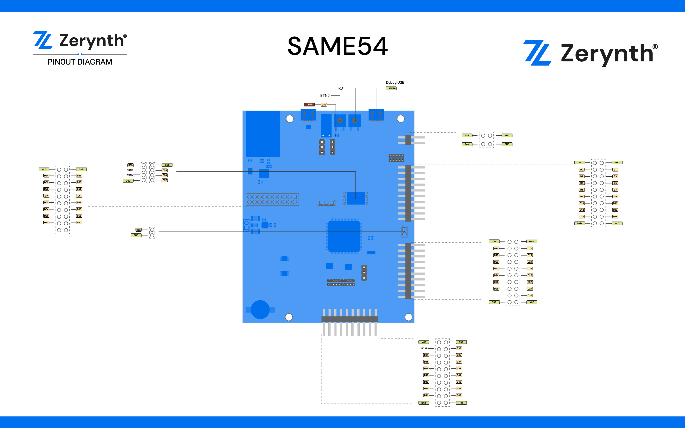

# Xplained Pro Sam E54

The SAM E54 Xplained Pro evaluation kit is ideal for evaluation and prototyping with the  [SAM E54 Cortex-M4 processor-based microcontrollers](https://www.microchip.com/wwwproducts/en/ATSAME54P20A). The Xplained Pro extension kits offer additional peripherals to extend the features of the device and ease the development of custom designs.

The SAM E54 Xplained Pro features a 32-bit ARM® Cortex®-M4 processor with Floating Point Unit (FPU), running up to 120 MHz ,up to 1 MB Dual Panel Flash with ECC, and up to 256 KB of SRAM with ECC

One of its most important features is the Atmel Embedded Debugger (EDBG), which provides a full debug interface without the need for additional hardware, significantly increasing the ease-of-use for software debugging. EDBG also supports a virtual COM port.

_Xplained Pro Sam E54. Copyright Microchip Technology_

!!! note
	All the reported information are extracted from the official  [Xplained Pro Sam E54 page](https://www.microchip.com/developmenttools/productdetails/atsame54-xpro), visit this page for more details and updates.

## Pin Mapping

Xplained Pro Sam E54 Official Schematic, Reference Design and Pin Mapping are available on the official  [Microchip User Guide](https://www.microchip.com/developmenttools/productdetails/atsame54-xpro).

## Flash Layout

The internal flash of the Xplained Pro Sam E54 is organized as a single bank of 512k. Zerynth VM starts at address 0x22000.

The flash memory is organized into blocks, each of which consist of 16 pages A single page contains 512 Bytes Each block = 16*512 = 8192 bytes

A single erase operation will erase a whole block of memory. (Erasing the block/page sets all bits to ‘1’) A single write operation can write a single page (512 bytes) maximum, to write more data, loop over the needed pages.

Ex: vhalFlashErase(0x22000,8192); vhalFlashWrite( 0x22000,&bb,8); //bb[2]={0x11111111,0x00000000}

## Device Summary

-   Microcontroller: ATSAME54P20A
-   Operating Voltage: 3.3V
-   UARTs: 2
-   SPIs: 2
-   I2Cs: 2
-   Flash Memory: 1 MB
-   Clock Speed: 120 MHz

## Power

The Xplained Pro Sam E54 can be powered via the USB connector or with an external power supply via “GND” and “5Vin” pins of the PWR header.

The device can operate on an external supply of 5V ±2% (±100mV) for USB host operation or from 4.3V to 5.5V if USB host operation is not required. Current recommended requirements, in external power supply mode, are:

-   minimum 1A to be able to provide enough current for connected USB devices and the device itself.
-   maximum is 2A due to the input protection maximum current specification

For powering the device through Target USB (debug USB port on Xplained pro kit), voltage of 4.4V to 5.25V and current of 500 mA are needed.

!!! note
	External power is required when 500mA from a USB connector is not enough to power the device with possible extension boards. A connected USB device in a USB host application might easily exceed this limit.

## Connect, Register, Virtualize and Program

The Xplained Pro Sam E54 debug port is connected to EDBG, which provides a virtual COM port to software on a connected computer. To recognize the device, all  **Windows**  (automatic driver software installation),  **OSX**  and  **Linux**  machines will recognize the device as a COM port automatically.

!!! note
	**For Linux Platform**: to allow the access to serial ports the user needs read/write access to the serial device file. Adding the user to the group, that owns this file, gives the required read/write access:

> -   **Ubuntu**  distribution –> dialout group
> -   **Arch Linux**  distribution –> uucp group

If the device is still not recognized or not working, the following udev rules may need to be added:

# Check SUBSYSTEM
SUBSYSTEMS=="hidraw", KERNEL=="hidraw*", MODE="0666", GROUP="dialout"

# Xplained Pro SamE54 Device
SUBSYSTEMS=="usb", ATTRS{idVendor}=="03eb", ATTRS{idProduct}=="2111", MODE="0666", GROUP="users", ENV{ID_MM_DEVICE_IGNORE}="1"
SUBSYSTEMS=="tty", ATTRS{idVendor}=="03eb", ATTRS{idProduct}=="2111", MODE="0666", GROUP="users", ENV{ID_MM_DEVICE_IGNORE}="1"

EDBG is also connected to the SAME54 hardware UART. Serial on pins RX0 and TX0 provides Serial-to-USB communication for programming the device through Atmel EDBG.

Once connected on a USB port the Xplained Pro Sam E54 device is recognized by Zerynth Studio. The next steps are:

-   **Select**  the Xplained Pro Sam E54 on the  **Device Management Toolbar**;
-   **Register**  the device by clicking the “Z” button from the Zerynth Studio;
-   **Create**  a Virtual Machine for the device by clicking the “Z” button for the second time;
-   **Virtualize**  the device by clicking the “Z” button for the third time.

!!! note
	No user intervention on the device is required for registration and virtualization process

After virtualization, the Xplained Pro Sam G55 is ready to be programmed and the Zerynth scripts  **uploaded**. Just  **Select**  the virtualized device from the “Device Management Toolbar” and  **click**  the dedicated “upload” button of Zerynth Studio and  **reset**  the device by pressing the Reset on-board button when asked.

!!! note
	Advanced programming and debugging through EDBG are available in  [Device Management Advanced Mode](/latest/reference/core/studio/docs/#advanced-device-widget)  selecting Atmel EDBG interface
<!--stackedit_data:
eyJoaXN0b3J5IjpbMjEyNTU3Mzk2MSwtMTQ4MTI0NzYxNF19
-->
